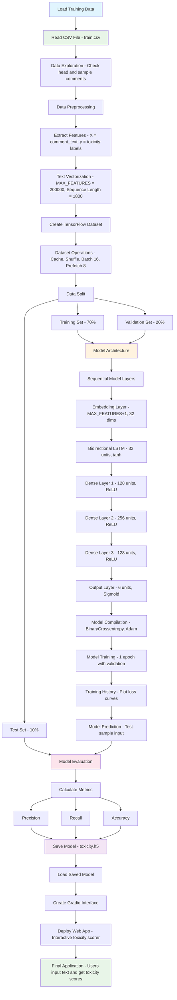

# 🛡️ Toxicity Detection Model

> A deep learning solution for real-time text toxicity detection using bidirectional LSTM networks with multi-label classification capabilities.

## 🚀 Project Overview

This project implements an end-to-end machine learning pipeline for detecting toxic comments across 6 different categories. The model uses advanced NLP techniques with TensorFlow/Keras to classify text content and provides a user-friendly web interface for real-time predictions.

### 🎯 Key Features

- **Multi-label Classification**: Detects 6 different types of toxicity simultaneously
- **Deep Learning Architecture**: Bidirectional LSTM with embedding layers for superior text understanding
- **Real-time Web Interface**: Interactive Gradio-based application for instant predictions
- **Optimized Data Pipeline**: Efficient TensorFlow dataset processing with caching and prefetching
- **Production Ready**: Saved model format for easy deployment and integration

## 🔄 Project Workflow



## 🏗️ Architecture Details

### Model Architecture
```
Sequential Model:
├── Embedding Layer (200,001 → 32)
├── Bidirectional LSTM (32 units, tanh)
├── Dense Layer (128 units, ReLU)
├── Dense Layer (256 units, ReLU)
├── Dense Layer (128 units, ReLU)
└── Output Layer (6 units, Sigmoid)
```

### Technical Specifications
- **Vocabulary Size**: 200,000 tokens
- **Sequence Length**: 1,800 tokens
- **Batch Size**: 16
- **Optimizer**: Adam
- **Loss Function**: Binary Crossentropy
- **Evaluation Metrics**: Precision, Recall, Accuracy

## 🛠️ Technologies Used

- **Deep Learning**: TensorFlow 2.x, Keras
- **Data Processing**: Pandas, NumPy
- **Visualization**: Matplotlib
- **Web Interface**: Gradio
- **Text Processing**: TensorFlow TextVectorization
- **Model Evaluation**: Scikit-learn metrics

## 📊 Dataset & Preprocessing

- **Data Source**: Multi-label toxicity classification dataset
- **Preprocessing Pipeline**:
  - Text vectorization with 200K vocabulary
  - Sequence padding/truncation to 1800 tokens
  - Train/Validation/Test split (70/20/10)
  - Dataset optimization with caching and prefetching

## 🎯 Model Performance

The model is evaluated using multiple metrics:
- **Precision**: Measures accuracy of positive predictions
- **Recall**: Measures coverage of actual positive cases
- **Accuracy**: Overall classification accuracy

*Note: Detailed performance metrics can be found in the training logs*

## 🚀 Getting Started

### Prerequisites
```bash
pip install tensorflow pandas matplotlib scikit-learn gradio
```

### Quick Start
1. **Data Preparation**: Place your `train.csv` file in the project directory
2. **Model Training**: Run the training pipeline
3. **Evaluation**: Assess model performance on test data
4. **Deployment**: Launch the Gradio interface for real-time predictions

### Usage Example
```python
# Load the trained model
model = tf.keras.models.load_model('toxicity.h5')

# Make predictions
def predict_toxicity(text):
    vectorized_text = vectorizer([text])
    predictions = model.predict(vectorized_text)
    return predictions > 0.5
```

## 🌐 Web Application

The project includes a user-friendly web interface built with Gradio:
- **Input**: Text comment for analysis
- **Output**: Toxicity scores across 6 categories
- **Features**: Real-time prediction, easy-to-use interface

## 📈 Future Enhancements

- [ ] Hyperparameter tuning for improved performance
- [ ] Model compression for faster inference
- [ ] Integration with additional datasets
- [ ] Advanced preprocessing techniques
- [ ] Ensemble methods for better accuracy
- [ ] API development for production deployment

## 🤝 Contributing

Contributions are welcome! Please feel free to submit issues, feature requests, or pull requests.

## 📄 License

This project is open source and available under the [MIT License](LICENSE).

## 📞 Contact

For questions or collaboration opportunities, please reach out via:

[](https://www.linkedin.com/in/mohan-ganesh-gottipati-22279b310/)
[](https://github.com/mohanganesh3)
[](mailto:mohanganesh165577@gmail.com)

---

⭐ **Star this repository if you find it helpful!**
